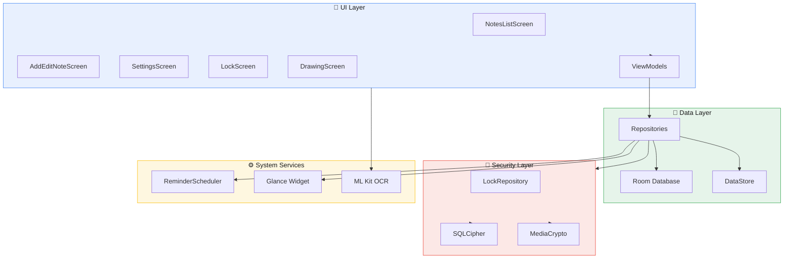
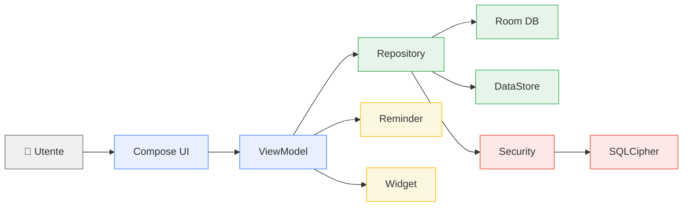

<div align="center">

# 📝 Notepad

### App Android open source per appunti
**Semplice · Veloce · Privata · Offline**

<br>

[](LICENSE)
[](https://github.com/0x-Ghost/notepad/releases/tag/v0.1.0)
[](https://github.com/0x-Ghost/notepad/releases/tag/v0.1.0)
[](https://developer.android.com/jetpack/compose)
[](https://kotlinlang.org)

<br>

Material Design 3 · Crittografia locale · Promemoria · Widget · OCR on-device

*Tutti i dati restano sul telefono — nessun account, nessun cloud*

<br>

<a href="https://github.com/0x-Ghost/notepad/releases/download/v0.1.0/notepad.apk">
  
</a>

<br>

<sub>
  <a href="https://github.com/0x-Ghost/notepad/releases/tag/v0.1.0"><b>Release v0.1.0</b></a>
  &nbsp;·&nbsp;
  <a href="https://github.com/0x-Ghost/notepad/issues">Segnala un bug</a>
  &nbsp;·&nbsp;
  <a href="#english">English</a>
</sub>

</div>

<br>

<table align="center">
<tr>
<td align="center" width="33%">
<b>🔒 Privacy</b><br>
<sub>Dati solo in locale</sub>
</td>
<td align="center" width="33%">
<b>🛡️ Crittografia</b><br>
<sub>SQLCipher + media cifrati</sub>
</td>
<td align="center" width="33%">
<b>📴 Offline</b><br>
<sub>Nessuna connessione richiesta</sub>
</td>
</tr>
</table>

<br>

---

## ⬇ Download

<table>
<tr><td width="180"><b>Versione</b></td><td><code>0.1.0</code> — pre-release</td></tr>
<tr><td><b>APK</b></td><td><a href="https://github.com/0x-Ghost/notepad/releases/download/v0.1.0/notepad.apk"><b>notepad.apk</b></a></td></tr>
<tr><td><b>Release</b></td><td><a href="https://github.com/0x-Ghost/notepad/releases/tag/v0.1.0">Notepad 0.1.0 (pre-release)</a></td></tr>
<tr><td><b>Android</b></td><td>8.0+ (API 26) · target API 35</td></tr>
<tr><td><b>Dimensione</b></td><td>~77 MB · build release firmata</td></tr>
</table>

> ⚠️ **Pre-release** — Prima versione pubblica open source. Funzionante e installabile, in fase di anteprima.

1. Scarica l'APK &nbsp;→&nbsp; 2. Aprilo sul telefono &nbsp;→&nbsp; 3. Consenti fonti sconosciute &nbsp;→&nbsp; 4. Avvia Notepad

---

## ✨ Funzionalità

<details>
<summary><b>📝 Note e editor</b></summary>
<br>

| | |
|:--|:--|
| Note di testo | Titolo, corpo libero, 12 colori pastello |
| Checklist | Elementi spuntabili, barrato, barra di progresso |
| Cambio tipo | Passa da testo a checklist e viceversa |
| Auto-salvataggio | Ogni 500 ms durante la modifica |
| Salvataggio manuale | Pulsante salva con indicatore di stato |
| Anteprima | Modalità preview del testo formattato |
| Duplica | Copia titolo, contenuto, etichette, media |
| Condividi | Esporta testo o checklist via share sheet |

</details>

<details>
<summary><b>🎨 Formattazione testo</b></summary>
<br>

| Formato | Sintassi |
|:--|:--|
| **Grassetto** | `**testo**` |
| *Corsivo* | `*testo*` |
| ~~Barrato~~ | `~~testo~~` |
| Sottolineato | `__testo__` |
| `Codice` | `` `testo` `` |
| Titolo | `## riga` |
| Elenco | `- elemento` |

Formattazione su selezione · rendering live · anteprima WYSIWYG

</details>

<details>
<summary><b>📂 Organizzazione</b></summary>
<br>

| | |
|:--|:--|
| 📌 Pin | Sezione "Fissate" in cima alla lista |
| 📦 Archivio | Schermata dedicata, ripristino con swipe |
| 🗑️ Cestino | Conservazione 30 giorni, svuota cestino |
| ↩️ Annulla | Snackbar per annullare azioni (5 secondi) |
| 👆 Swipe | Destra → archivia · Sinistra → cestino |
| ⋮ Menu | Pin, duplica, archivia, elimina (long press) |

</details>

<details>
<summary><b>🔍 Ricerca, filtri e ordinamento</b></summary>
<br>

**Filtri**

| Filtro | Descrizione |
|:--|:--|
| Tutte | Tutte le note attive |
| Fissate | Solo note pinnate |
| Con colore | Sfondo colorato |
| Con promemoria | Promemoria impostato |
| Con immagine | Allegati immagine |
| Per etichetta | Chip orizzontali |

**Ordinamento** — data modifica · data creazione · titolo A→Z

Ricerca in tempo reale su titolo, corpo e checklist. Preferenze salvate.

</details>

<details>
<summary><b>🏷️ Etichette</b></summary>
<br>

| | |
|:--|:--|
| Creazione | Nome + colore (8 palette) |
| Gestione | Modifica ed eliminazione |
| Assegnazione | Più etichette per nota |
| Anteprima | Fino a 3 etichette sulla card |

</details>

<details>
<summary><b>🖼️ Contenuti multimediali</b></summary>
<br>

| | |
|:--|:--|
| 🖼️ Immagini | Dalla galleria, più per nota |
| 🔍 Lightbox | Zoom pinch, pan, doppio tap |
| ✏️ Disegno | Canvas a mano libera → immagine allegata |
| 🎙️ Note vocali | Registrazione + player con forma d'onda |
| 📄 OCR | Estrai testo dalle immagini (ML Kit, on-device) |

</details>

<details>
<summary><b>⏰ Promemoria</b></summary>
<br>

| | |
|:--|:--|
| Impostazione | Selettore data e ora |
| Notifiche | Anteprima contenuto, tap → apre la nota |
| Persistenza | Ripristino dopo riavvio dispositivo |
| Privacy | Contenuto oscurato se app bloccata |

</details>

<details>
<summary><b>🔐 Sicurezza e privacy</b></summary>
<br>

| | |
|:--|:--|
| 🔑 Blocco app | Password (min. 4 caratteri) |
| 👆 Biometria | Impronta o volto |
| 🗄️ Database | Crittografato con SQLCipher |
| 📁 Media | Immagini e audio cifrati a riposo |
| ⏱️ Auto-blocco | Rilock dopo 15 s in background |
| 🚫 Screenshot | Blocco cattura schermo |
| ☁️ Nessun cloud | No backup, no account, no telemetria |
| 📴 Offline | Nessuna connessione Internet |

</details>

<details>
<summary><b>📱 Widget</b></summary>
<br>

| | |
|:--|:--|
| Home screen | Fino a 5 note fissate |
| Anteprima | Colore, titolo, progresso checklist |
| Interazione | Tap → app o nota specifica |
| Layout | Ridimensionabile |

</details>

<details>
<summary><b>🔗 Integrazione sistema</b></summary>
<br>

| | |
|:--|:--|
| Ricevi testo | Condividi da altre app verso Notepad |
| Tema | Chiaro · Scuro · Sistema |
| Layout | Griglia masonry 2 colonne |
| Lingua | Italiano |

</details>

---

## 🏗️ Architettura



<br>

<table>
<tr>
<td valign="top" width="50%">

**📁 Struttura sorgenti**

```
com/notepad/app/
├── 📂 data/
│   ├── dao/
│   ├── database/
│   ├── model/
│   ├── preferences/
│   └── repository/
├── 📂 security/
│   ├── CryptoManager
│   ├── LockRepository
│   └── SecureDatabaseFactory
├── 📂 ui/
│   ├── screens/
│   ├── components/
│   ├── viewmodel/
│   └── theme/
├── 📂 reminder/
├── 📂 util/
└── 📂 widget/
```

</td>
<td valign="top" width="50%">

**🧰 Stack tecnologico**

| Layer | Tech |
|:--|:--|
| UI | Jetpack Compose + Material 3 |
| Architettura | MVVM + Repository |
| Database | Room + SQLCipher |
| Preferenze | DataStore |
| Navigazione | Navigation Compose |
| Widget | Glance AppWidget |
| OCR | ML Kit (on-device) |
| Immagini | Coil |
| Sicurezza | Security Crypto + Biometric |

</td>
</tr>
</table>



---

## 🔧 Compilazione

<details>
<summary><b>Build rapida (debug)</b></summary>
<br>

**Prerequisiti:** Java 17 · Android SDK API 35 · Internet (solo prima build)

```bash
git clone https://github.com/0x-Ghost/notepad.git
cd notepad
chmod +x build-apk.sh
./build-apk.sh
```

Output: `app/build/outputs/apk/debug/app-debug.apk`

</details>

<details>
<summary><b>Build release firmata</b></summary>
<br>

```bash
cp keystore.properties.example keystore.properties
./gradlew assembleRelease
```

Output: `app/build/outputs/apk/release/app-release.apk`

> `keystore.properties` e `*.keystore` non vanno mai committati.

</details>

---

## 🔑 Permessi

| Permesso | Motivo |
|:--|:--|
| `POST_NOTIFICATIONS` | Promemoria |
| `RECEIVE_BOOT_COMPLETED` | Ripristino promemoria |
| `SCHEDULE_EXACT_ALARM` | Promemoria precisi |
| `RECORD_AUDIO` | Note vocali |
| `USE_BIOMETRIC` | Sblocco biometrico |

L'app **non** richiede accesso a Internet.

---

## 🤝 Contribuire

1. **Fork** del repository
2. Crea un **branch** (`git checkout -b feature/nome`)
3. **Commit** (`git commit -m "Aggiunge ..."`)
4. Apri una **Pull Request**

→ [Issues](https://github.com/0x-Ghost/notepad/issues)

---

## 📄 Licenza

[MIT](LICENSE) · © Notepad Contributors

---

<br>

## English

<div align="center">

### Privacy-focused Android notes app

Encrypted local storage · Checklists · Labels · Reminders · OCR · Biometric lock · Widget

<br>

<a href="https://github.com/0x-Ghost/notepad/releases/download/v0.1.0/notepad.apk">
  
</a>

<br><br>

Android 8.0+ · <a href="https://github.com/0x-Ghost/notepad/releases/tag/v0.1.0">Pre-release v0.1.0</a> · <a href="LICENSE">MIT</a>

</div>
